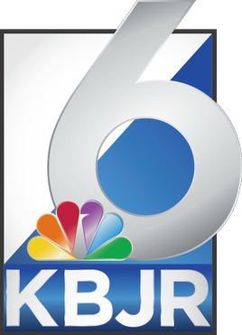

I've created a new channel on Video Bark One called [Channel One](https://video.tonybark.com/video-channels/ch1/) (``ch1@video.tonybark.com``). It's a channel for public domain and Creative Commons-licensed content, such as films, shows or podcasts.

<small>Initial channel one logo</small>

Channel One will include videos from TWiT's Hands-on Tech, Events podcast and their clips because their content is licensed under the [Creative Commons](https://twit.tv/about/license). As part of this change, I've also updated the recent videos section on my main site's homepage to show the channel name below the title instead of the uploader's, in order to avoid confusion.

<small>A channel 6-branded station.</small>

I do plan on eventually re-branding the channel to something similar to local stations here in the US. Because while "channel 1" is intended to be generic in order to allow for content flexibility, I do still want it to have some sort of identity.